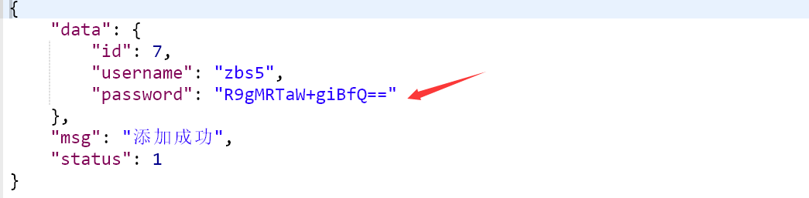
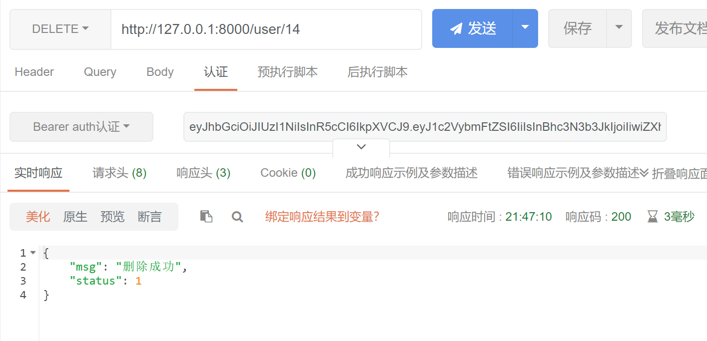
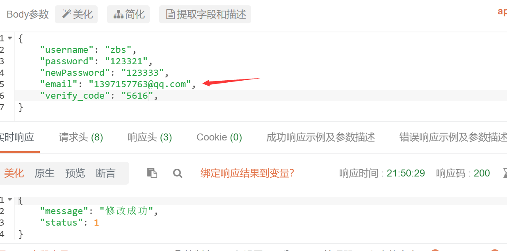

#每日学习进度
- **4.8**

    阅读任务书，确定任务。学习gin相关知识。配置gin相关包。https://learnku.com/docs/gin-gonic/2019
  http://www.topgoer.com/gin%E6%A1%86%E6%9E%B6/%E7%AE%80%E4%BB%8B.html
  
- **4.9**
  
  学习gin(感觉知识点好碎)，配置数据库mysql，熟悉gorm库，之前用的是xampp集成环境

  了解restful风格的api编写
  1. 获取文章 /blog/getXxx Get blog/Xxx

  2. 添加 /blog/addXxx POST blog/Xxx

  3. 修改 /blog/updateXxx PUT blog/Xxx

  4. 删除 /blog/delXxxx DELETE blog/Xxx
  ```
  r := gin.Default()
  r.GET/.PUT/.POST/.RUN //方法
  ```
  
  创建"文章类型"表单，分模块创建文件夹，写了初步代码。
  ```
  mysql> CREATE TABLE `articles`(`id` int(10) unsigned NOT NULL auto_increment,
    -> `tag_id` int(8) unsigned DEFAULT '10' comment '标签ID',
    -> `title` varchar(100) DEFAULT '' COMMENT '文章标题',
    -> `content` text,
    -> `date_time` datetime,
    -> primary key(`id`)
    -> )ENGINE=MYISAM AUTO_INCREMENT=1 DEFAULT CHARSET=UTF8MB4;
  ```
  
  先跟着搭了类似的框架

- **4.10**
  
  开始搭建，似乎还没有问题
  
  初步构建增删改查操作，bug冒出来了，对于mysql事件类型有bug...
  学会使用google插件postman，确实很强大，来进行post等操作
  
  
- **4.11**

  添加文章没有问题了，但是对这个报错很疑惑，我没有定义date_time这一列啊，不知道为什么
  create的时候，它会这么匹配，猜想可能是dateTime类型的转化问题？？？
  
  增删改查基本完成，返回值形式应该是json，然后查询如何将信息写入配置文件中并由其它模块调用。
  增加配置文件config.yaml，链接数据库通过加载load()函数处理配置文件信息。
  part1应该差不多了吧。。。
  查阅关于数据库表设计的相关资料
  
  属性的 **关联**/**约束**
  好像有点难以下手了，是需要搭个简单的前端吗？但不太会鸭
  准备学习下中间件鉴权
  
- **4.12**

  对写评论的api不太了解，猜测可能url类似为点击某个文章，发送Get请求
  ```
  /articles/id/...comment操作
  ```
  为验证猜想，决定找几个博客试试。查询了一下资料显示有的参数中需要有评论页。
  
  发现了一个bug的原因，原来gorm在做数据迁移时会自动变成复数，怪不得一开始创建article时报错不存在articles数据库。
  准备先搞注册功能唉
  
- **4.13**

  添加用户数据库及其相关增删改查，对文章和用户实现分页返回功能。

  考虑到用户隐私，调用Scrypt对用户密码进行盐值加密，目前无可破解方案。

  

  在数据库增前进行加密，查阅资料了解到还gorm可以编写钩子函数，编写**BeforeSave()**

  准备编写登录接口，查阅关于JWT中间件的资料

  完成jwt模板编写，并通过token进行验证

  part3功能一功能三基本完成

  带token的删除，如果token错误，则会报错，虽然对程序无影响，应该将其写在日志里
  
  添加评论模块，从晚上6点一直到11点半，终于把part2搞了差不多了，但在网上找的数据库匹配语句不太懂其含义，明天 
  再查查看。（明天晚上有攻防！！！嗐
  
- **4.14**
  
  了解mysql和gorm的高级方法使用，了解left join on多表联合条件查询。

  加入修改密码模块，通过中间件验证token，暂时没有加入邮件验证。（今天课多www

  按照官网文档那样加入钩子函数但是 **BeforeUpdate()**不知道怎么没有奏效。

  改了几个修改密码的bug，加入对旧密码验证。

  明天看看邮件服务。

- **4.15**

  开启邮箱smtp服务，了解如何进行发送邮件验证码，编写验证模块。

  成功发送四位随机验证码，用户在登录和更改密码时需输入正确的验证码。

  为方便进行注册用户和修改密码时的Json数据绑定，添加了Verify类。

  在邮件验证码验证环节还有点问题，学习golang的限速器time/rate包，期望通过此对邮件函数的调用进行时间限制。

  成功完成邮箱验证码限制为一分钟有效时间。

  

  明天课太恐怖了，从早上到晚十二节。估计做不了啥了。

- **4.16**

  今天就在毛概课上看了下关于本地缓存的文章，做完数电实验，十点才回来，快收尾啦！！！